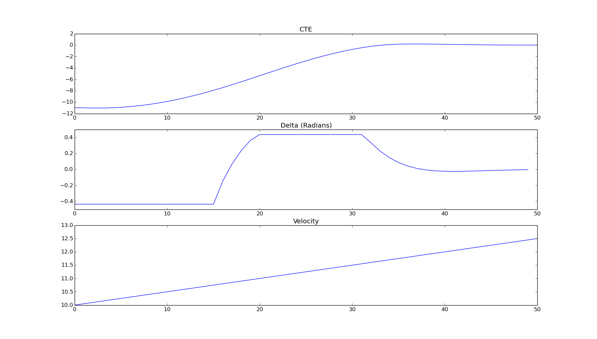

# CarND Controls Quizzes

Quizzes for *Vehicle Models* and *Model Predictive Control* sections.

1. [Global Kinematic Model Quiz](./global_kinematic_model) - Implement the *Global Kinematic Model*.
2. [Polynomial Fitting Quiz](./polyfit) - Fit and evaluate polynomials.
3. [Mind The Line Quiz](./mpc_to_line) - Implement MPC and minimize cross track and orientation errors to a straight line trajectory.  See [this document](https://github.com/Horki/CarND-MPC-Quizzes/blob/master/install_Ipopt_CppAD.md) for setup tips for executing the plotting code in the ```MPC.cpp``` solution file.

To do a quiz:

1. Go to quiz directory.
2. Make a build directory with `mkdir build`.
3. Change into the build directory, `cd build`.
4. Build with conan `conan install .. --build missing -s compiler.libcxx=libstdc++11`.
5. Compile the project, `cmake .. && make`.

A solution for each quiz is presented in the solution directory.



## Dependencies

The *Global Kinematic Quiz* and *Polynomial Fitting* quizzes have all the dependencies in repo. For the *MPC* quiz
you'll have to install Ipopt and CppAD.  Please refer to [this document](https://github.com/udacity/CarND-MPC-Quizzes/blob/master/install_Ipopt_CppAD.md) for installation instructions.

* Ipopt: [COIN-OR Interior Point Optimizer IPOPT](https://github.com/coin-or/Ipopt)
* CppAd: [A C++ Algorithmic Differentiation Package](https://coin-or.github.io/CppAD/doc/cppad.htm)

### Install dependencies with packer

```sh
packer -S cppad coin-or-ipopt
```

### Os X install dependencies with brew

```sh
# CppAd
brew install cppad
# Ipopt
brew update
brew install bash gcc
brew link --overwrite gcc
brew install pkg-config
brew install gfortran
brew install ipopt
```
